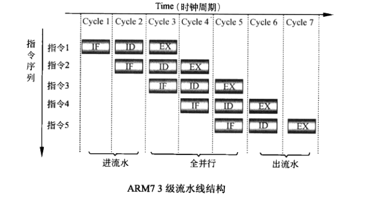

&ensp;&ensp;&ensp;&ensp;在公司实习遇到好多次Pipeline这个东西了，知道他中文名叫管道，但是总好像不太明白这是个什么东西。开始一想，管道，和队列不是一个东西吗，后来查了资料发现还是有区别的。这里面还涉及了《计算机组成原理》课程中的多级流水线的知识。  
<!-- more -->

> &ensp;&ensp;&ensp;&ensp;我要吐槽一下，上周因为这周要搞中期检查的原因，就没写博客，疯狂的进行中期文档编写和写代（八）码（哥）。搞的才立flag一周就崩了。微信朋友圈发了一个10块的红包，3个人，第一个人就拿了9块多，这是什么垃圾算法。这周又疯狂地搞毕设，趁着周末疯狂地push，也算是把前端模板全部整合到后端了。所以接下来的毕设工作就是完成爬虫部分代码和计算代码的实现了。  

## 概念
&ensp;&ensp;&ensp;&ensp;让我们来看看度娘的百科解释：  

> &ensp;&ensp;&ensp;&ensp;pipeline，计算机用语，意思是导管及物动词，用导管输送。    

&ensp;&ensp;&ensp;&ensp;什么鬼东西？就这么一句话，无比简洁啊。可能他想说“精髓已经在这了，自己悟去吧少年”。  

&ensp;&ensp;&ensp;&ensp;当然，咱们换个词搜索，“流水线”，这就有很长的解释了。  
> &ensp;&ensp;&ensp;&ensp;流水线（pipeline）技术是指在程序执行时多条指令重叠进行操作的一种准并行处理实现技术......   

&ensp;&ensp;&ensp;&ensp;所以，pipeline这个东西，有时候他叫管道，有时候也叫流水线，对于我现在的理解就是：pipeline就是多个queue(队列)的组合。  

## 举例
### 生活中的例子
&ensp;&ensp;&ensp;&ensp;上次看别人举例是一个餐厅打饭的例子，我就不照搬了，咱换个例子。办身份证大家应该都去过吧，一排的工作人员在那里坐着。然后第一列拍照，第二列填信息，第三列验证信息按手印......这么多步骤真的很繁琐了。不过仔细想想，效率也挺高了。假如他们的系统设计有毛病，一个人办身份证一定要一次办完才能进行下一个，然后工作人员又粗心，经常在不同的步骤搞错，或者来了一个不太会用现代化工具的大妈，那就很麻烦了。  
&ensp;&ensp;&ensp;&ensp;让我们来梳理一下，假设现在有4个工作人员服务4条排队的人，第一列是拍照的，第二列是填信息，第三列是电脑验证信息按手印，第四列是拿单子走人。假如同时只能办一个人的，那4个工作人员走到的期间，你后面的人都是排队等候的，浪费了很多时间。现在你拍完照，直接去第二列填信息，上一列的就可以拍照了，大家都在忙碌，时间充分利用了起来，而且顺序也没变，不存在你拍完照直接就去拿单子走人了的情况。这就是管道了，充分利用了队列的效率，减少等待。（对于大妈那种情形，同时设置两个工作人员做同样的工作就成，遇到两个大妈？当我没说！）  

### 组成原理中的例子
&ensp;&ensp;&ensp;&ensp;让我们先来看个图。  
  
&ensp;&ensp;&ensp;&ensp;学组成原理的时候，最后那两章应该有提到过流水线技术。而且书中也很多类似于上面的图。这个是个ARM的3级流水线技术。ARM7把指令执行的时间分成了3个步骤：取指IF，译码ID，执行EX。这样的话，由于取指，译码，执行都是不同部件的功能，当多条指令执行的时候，就不用每次都等上一条指令完成再进行下一条了，可以将多个部件充分利用起来，减少等待时间，提高效率。  


## 应用
### linux系统命令中的管道
&ensp;&ensp;&ensp;&ensp;linux系统下有个grep命令，这个接触过的应该知道吧。例如：  
```bash
ll | grep "你好帅啊"
```
&ensp;&ensp;&ensp;&ensp;这个命令就是管道的经典应用，作用是列出当前目录文件并且筛选含有`你好刷帅啊`字符串的行进行显示，ll是一个命令执行完的输入扔进管道，然后由grep命令进行正则匹配筛选。看到中间那根竖线了没，是不是很像管道，哈哈，自己脑补吧。  

### 持续集成(CI)/持续交付(CD)中的管道
&ensp;&ensp;&ensp;&ensp;这个也是新接触到的东西，具体的一些骚操作还在学，等我进行了一次最(乱)佳(搞)实(一)践(通)之后再写篇博客聊聊。管道在这里的大概的作用就是，把对一个项目的多个任务（例如测试、代码扫描、部署开发机、部署生产机，打包镜像......）扔进管道，然后执行。  

### 系统架构中的管道（中间件为例）
&ensp;&ensp;&ensp;&ensp;这个其实很常见了，中间件应该知道吧，这也是个经典应用。middleware这东西，大型项目里面到处可见。假如我写了一个web程序，对一个用户请求要进行一些包装，安全检查，筛选，权限过滤等等功能的时候我不可能对每个处理函数都来一遍吧。这时候就上中间件了，直接把这些通用的扔进中间件。而这里因为是管道模式，所以并不会说你一个请求过来，一定要过了所有的中间件之后下个请求才能进行中间件过滤，这样太慢了，管道模式就把时间利用地非常好。  

不早了，洗洗睡吧。  

